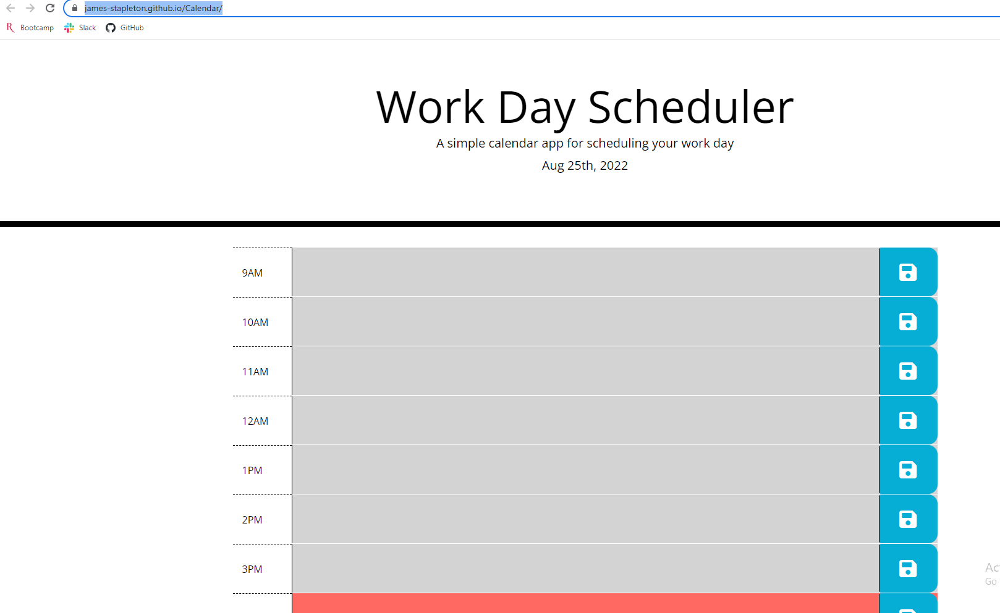

# Calendar

## Description 

This is a simple calendar app that allows the user to input and store a plan for their work day. It includes the current day up top using moment(), text areas for each hour of the day, and color coding to indicate the past, the present, and the future. Color coding is achieved by comparing the ids of the textarea parents to moment().hours. Local storage is used to save and reload entries in each text area in case the browser is refreshed. 

## Link

https://james-stapleton.github.io/Calendar/

## Screenshot

